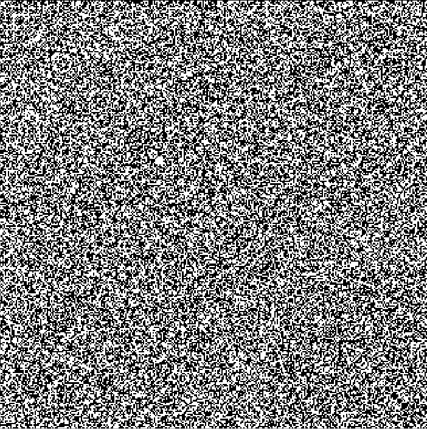
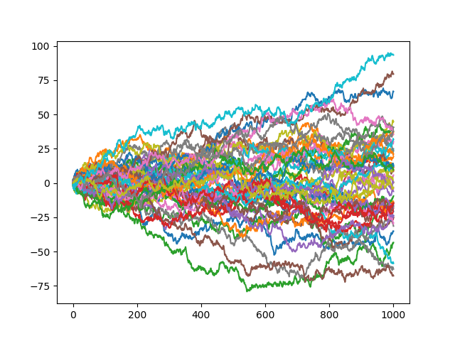

# Misc Math
A collection of scripts related to number theory and quantitative finance.

### UlamSpiral.py

This script implements [Ulam's Spiral](https://en.wikipedia.org/wiki/Ulam_spiral). As the size increases checking for primes will get computationally more expensive and runtime increases in a nonlinear fashion. The picture below shows Ulam's Spiral up to 5 Mio. 

  

### Collatz.py

This scripts implements the [Collatz's Conjecture](https://en.wikipedia.org/wiki/Collatz_conjecture). It returns the series, and the primefactors of each elements in the series. As well as a simplified series containing only the odd elements and a graph. Further visualization will follow. 

### RandomNumber.py
This script is linear congruential pseudo random number generator that generates 100'000 random numbers. After normalizing them into an intervall between zero and one, pixels are with a value of less than 0.5 are drawn black, whereas all the other pixels are left white. That way you can easiliy detect patterns, which depend on the parameters a (multipier) and b (increment).

The formula is a follows: New_Seed = (Old_Seed * a + b) mod m

  

    

### WienerProcess.py
This script produces vectors with the values that simulate a Wiener process in discretized form. You can define number of processes and and the number of steps per process.

  

